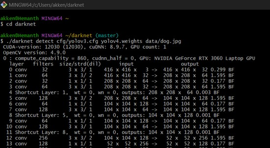
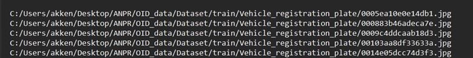
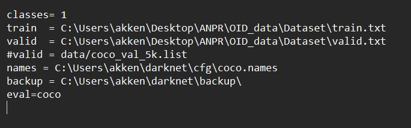
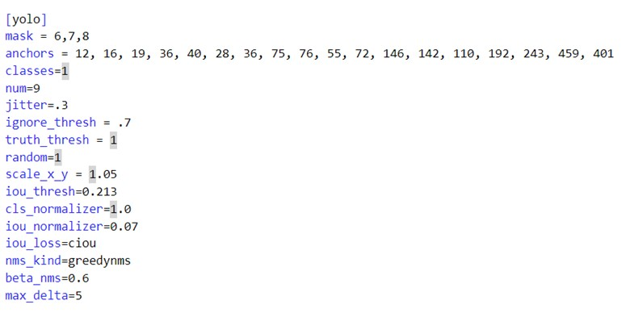

# AUTOMATIC LICENSE NUMBER PLATE DETECTION USING YOLOv4
## Work Progress:
### Software Requirements:
1.	Nvidia GPU (RTX3060)
2.	CUDA and CUDNN
3.	Darknet
4.	OpenCV 
5.	YOLOv4 Weights
6.	Visual Studio for C++ requirements
7.	Git Bash for interacting with the darknet.
8.	Anaconda for python
9.	Cmake to configure build files for OpenCV and darknet.
#### Installation Steps:
1.	Install OpenCV, Cmake, CUDA, CUDNN and visual studio.
2.	After installation, make sure that the environment variables are set up correctly.
3.	Now using Cmake, make a build file that enables GPU using CUDA and CUDNN.
4.	Build the file in the OpenCV folder by selecting fast Math enable, OpenCV World enable, CUDA, and CUDNN enable.
5.	After following the above steps, proceed to the darknet. We can find darknet framework source files in git. 
6.	Set up the build file using OpenCV and Darknet, before doing it we need to enable GPU, OpenCV, and CUDA in the Cmake file of Darknet.
7.	Now check using bash, whether the darknet is working or not using commands.

    

#### References for the above installations: 
1.	https://arxiv.org/abs/2004.10934 
2.	https://developer.nvidia.com/cuda-toolkit 
3.	https://pjreddie.com/darknet/yolo/
#### Dataset: Google Open image Dataset:
 https://storage.googleapis.com/openimages/web/visualizer/index.html?type=detection&set=train&c=%2Fm%2F01jfm_
1.	Train – 1500 images and 1500 annotations of License plates
2.	Valid – 300 images and 300 annotations
3.	Test – 300 images and 300 annotations
Images are of different license plates and labels have the coordinates of the license plate.

#### Dataset Pre-Processing:
1.	Convert the images and annotations into a .txt file which contains the location of the image and its labels.

    

2.	After getting the .txt file, we need to set up Coco. data, coco. names and yolov4.cfg files.
Classes represent the number of detection types.
Ex: license plate is one of the classes.
Train and valid path should be written in coco. data file.

    
    
* Coco. names are the files in which we write the name of the detection type, i.e. License Number Plate.
Inside the yolov4.cfg file we need to change the filters and classes.

* Filters are number convolution filters used in CNN. Convolutional filters are small matrices used to convolve across the input image to extract features.
* Batches are a subset of the training data. for example, if the batch size is 32, it means that the model will process 32 training examples at once before updating its parameters.
#### To Configure Your Variables in yolov4.cfg file:
* width = 416
* height = 416
* These can be any multiple of 32, 416 is standard, you can sometimes improve results by making the value larger like 608 but will slow down the training.
* max_batches = (# of classes) * 2000, but no less than 6000 so if you are training for 1, 2, or 3 classes it will be 6000, however detector for 5 classes would have max_batches=10000
* steps = (80% of max_batches), (90% of max_batches), so if your max_batches = 10000, then steps = 8000, 9000)
* filters = (# of classes + 5) * 3, so if you are training for one class then your filters = 18, but if you are training for 4 classes then your filters = 27
  
    

* After configuring the yolov4.cfg, we need to open bash and train our model using coco. data and yolov4.cfg file.
***“!./darknet detector train <path to obj.data> <path to custom config> yolov4.conv.137 -dont_show -map”***
* Path to obj. data is coco. data, the path to the custom config is the yolov4.cfg path.
* After executing the following command training of the model will start on our custom dataset, it might take around 5 hours to train the model. Once the model is trained, we can use the model to detect the license plates.
* 
    

#### Reference to configure YOLO for Custom Dataset: 
https://colab.research.google.com/drive/1_GdoqCJWXsChrOiY8sZMr_zbr_fH-0Fg?usp=sharing#scrollTo=qaONUTI2l4Sf  
