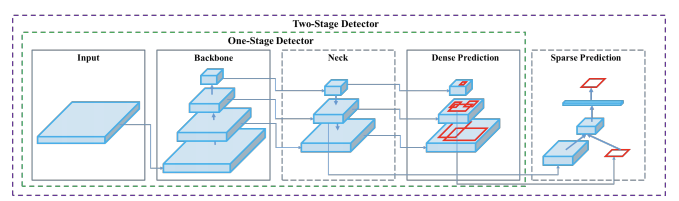
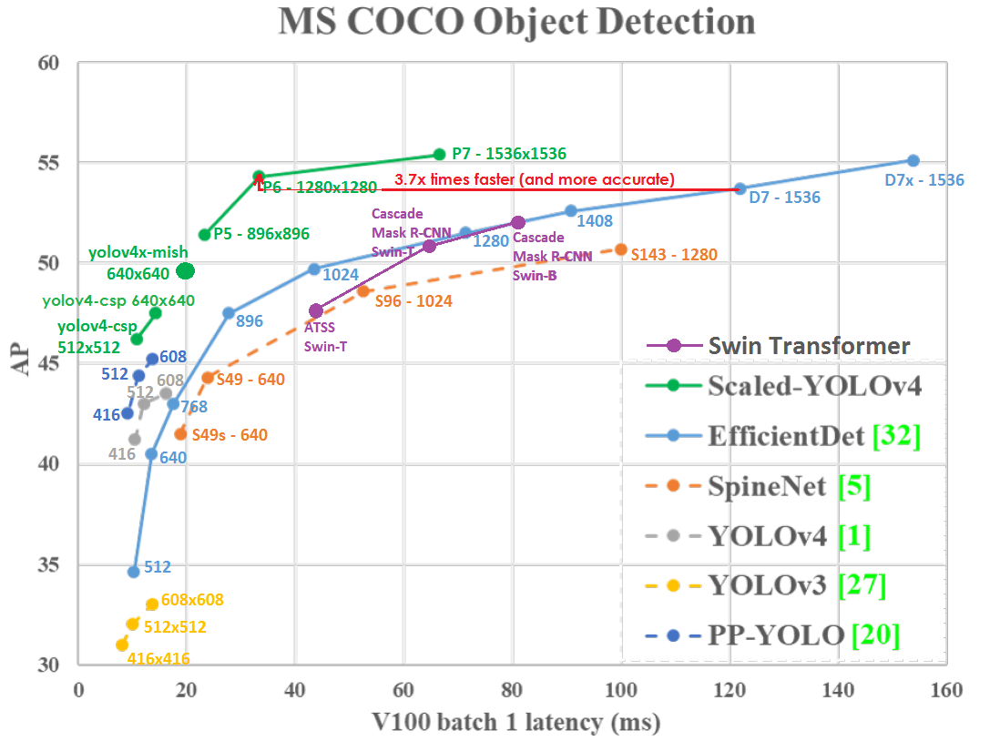
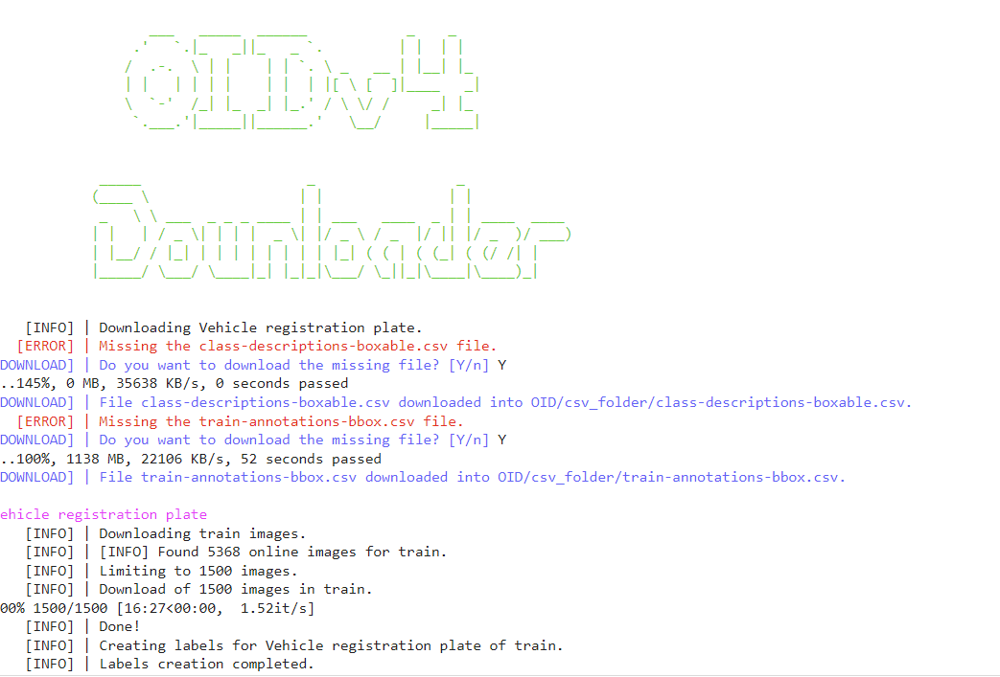
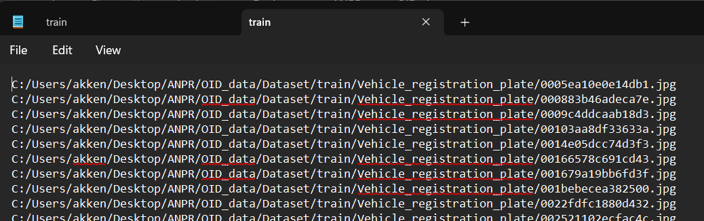
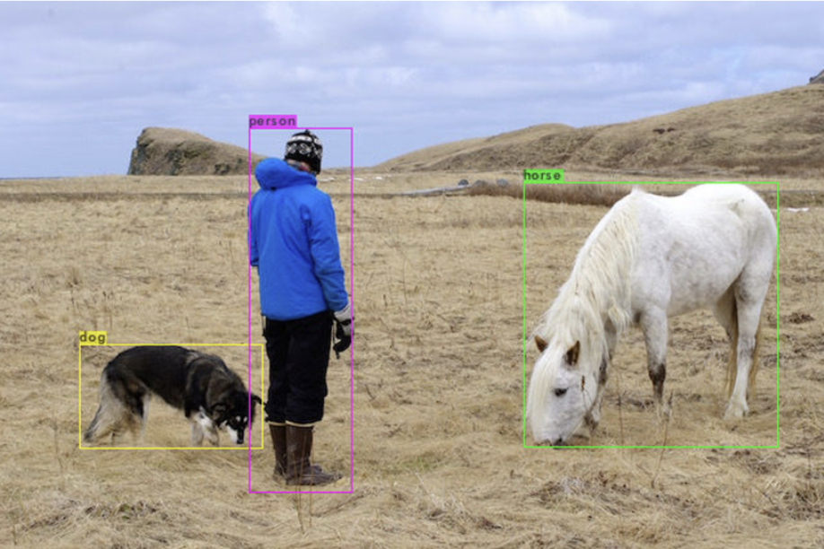
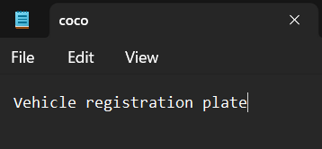

# Automatic License Number Plate Recognition using YOLOv4 and darknet

- Automatic License Number plate recognition using YOLOv4
- Prepared for UMBC Data Science Master Degree Capstone by Hemanth Akkenapally under the guidance of Dr Chaojie (Jay) Wang
- Author Name: Hemanth Akkenapally
- LinkedIn: Akkenapally Hemanth
- GitHub: Hemanth-Akkenapally
- PowerPoint presentation: https://github.com/Hemanth-Akkenapally/UMBC-DATA606-Capstone/blob/main/docs/Capstone_Hemanth.pptx
- Youtube Link: https://youtu.be/zSoCnQFCELM
    
## 1. Introduction

- YOLO is You Only Look Once, it is an object detection model. they are trained to look at an image and search for a specified object classes. After founding the objects, they are bounded by a box and class is identified.
- YOLOv4 architecture is shown in pictorial representation where it has 2 stages to detect the class which is mentioned in configuration file. 
- Backbone Network:
YOLOv4 starts with a stable and consistent backbone network, often based on Darknet architecture. This network extracts essential features from the input image through convolutional layers. Components like CSPDarknet53 to enhance feature reuse and reduce computational complexity.
- Detection Head:
YOLOv4's detection head predicts bounding boxes and class probabilities. It utilizes feature pyramid networks (FPN) for multiscale feature fusion, enabling precise and accurate detection across different object sizes. Techniques like Mish activation functions and spatial pyramid pooling (SPP) enhance feature representation and context modeling for improved accuracy.

- Darknet is a deep convolutional neural network (CNN) architecture designed for fast and efficient object detection. It is known for its simplicity and effectiveness in processing visual data, making it suitable for real-time applications like YOLOv4.
- Darknet is loaded from the following github: https://github.com/AlexeyAB/darknet.
- performance difference listed in below picture.

## 2. Background

- What is it about?
  - Automatic License Number Plate recognition is a technology which uses optical character recognition to read vehicle plates. 
  ANPR systems typically use cameras and specialized software to capture images of vehicles and extract the alphanumeric characters from their license plates.  
- Why does it matter? 
  - This technology is commonly used in law enforcement for purposes such as traffic enforcement, vehicle tracking, and security surveillance. ANPR systems can automatically identify vehicles of interest by matching their license plate numbers against databases of vehicles of interest, stolen vehicles, or vehicles with outstanding warrants.
- What are your research questions?
  - we can increase the accuracy, speed and adaptability using YOLOv4 algorithm.
  - We can develop a user friendly UI to utilize the model to detect the plates automatically upon providing a sample data.
  
## 3. Data 

- Dataset is scrapped from open image dataset: "https://storage.googleapis.com/openimages/web/visualizer/index.html?type=detection&set=train&c=%2Fm%2F01jfm_" using OIDv4Toolkit.

- Dataset contains Train, Validation and Test Images along with annotations.
  - Each image is scrapped with image file and a csv which contains the annotations of location of the plate.
- Train dataset contains: 1500 images (total 1500 images + 1500 annotated entries in a csv file)
- Validation dataset contains: 300 images (total 300 images + 300 annotated entries in a csv file)
- Test dataset contains: 300 images (total 300 images + 300 annotated entries in a csv file)
- dataset is downloaded inside a folder called OIDv4Toolkit. 

## 4. Data Prepocessing

- Data is downloaded in the format of images and its annotations  
   ex: Vehicle registration plate 622.72 405.75974400000007 798.08 494.079744 
- Train,Test and valid dataset images and annotations are downloaded, after getting the data we need to create a text file to support for training of YOLOv4.
- Each dataset has its seperate text file where image locations are mentioned like below
- Example: Train.txt, Test.txt and Valid.txt

- To get the locations txt file, you can run textfile.py which is inside notebooks folder.
- Now get darknet running inside your colab file.

## 5. Model Training using License Custom dataset

- **Darknet build and detection test:**
  - Before going for the training yolov4 model, there are some configurations and notes to make. Note down the paths of datasets train and test, txtfile and also class name i.e; vehicle registration plate.
  - Now install darknet to run the yolov4 model, official complete darknet is cloned from git hub repo of alexyAB darknet.
  - after downloading, go to darknet directory. Now build the binary files which are required for the nueral network to run using cmake command inside darknet folder.
  - Cmake command builds the make files, it reads the cmakelists.txt file which contains the configuration instructions for the build process for darknet.
  - Cmakelists.txt has this following edits:\
  %cd darknet\
  !sed -i 's/OPENCV=0/OPENCV=1/' Makefile\
  !sed -i 's/GPU=0/GPU=1/' Makefile\
  !sed -i 's/CUDNN=0/CUDNN=1/' Makefile\
  !sed -i 's/CUDNN_HALF=0/CUDNN_HALF=1/' Makefile
  - After generating the make files, now download the pre-trained weights for nueral network. pre-trained weights are the weights which we use to predict the inital error in the first layer of network. it generates the weights for next layer to reduce the error and iterated through whole process.
  - After getting the weights, Test the darknet functionality by running the detection of an image which are already present inside data folder in darknet.
  - Write a helper function which displays the image after predicting the objects.

  

  - upon successful detection, now modify the darknet files for the custom license dataset

- **Darknet configuration for Custom License Dataset:**
  - YOLOv4 object detection runs for several classes by default, we need to modify it to run on only specific class based on our requirements.
  - To run the YOLO on custom dataset we need to make some modification inside darknet directory:
  1. custom cfg file
  2. coco.data and coco.names
  3. train.txt file and test.txt file(optional)
  -  change coco.names file and enter the name of the custom object name: vehicle registration plate.

  

  - Now modify coco.data, A file where we use to train the model. Inside coco.data we will set up the location of train.txt, test.txt, coco.names, number of classes and a backup location for weights to download.

  

  - yolov4-custom.cfg is 

## 6. Application of the Trained Models

Develop a web app for people to interact with your trained models. Potential tools for web app development:

- **Streamlit Application :** 

## 7. Conclusion

- Summarize your work and its potetial application
- Point out the limitations of your work
- Lessons learned 
- Talk about future research direction

## 8. References 

1. https://www.mdpi.com/2075-1680/12/5/424
2. https://roboflow.com/model/yolov4
3. https://github.com/kiyoshiiriemon/yolov4_darknet
4. https://blog.51cto.com/u_15067242/3553533
5. https://arxiv.org/abs/2004.10934 
6. https://developer.nvidia.com/cuda-toolkit 
7. https://pjreddie.com/darknet/yolo/
