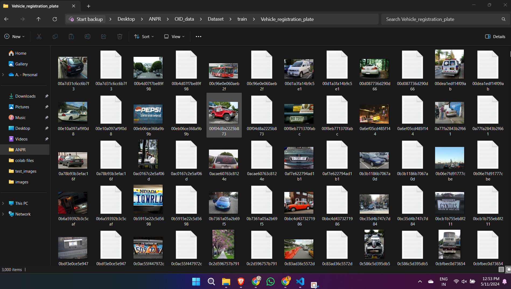
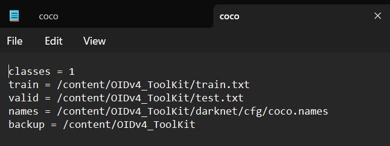

# Automatic License Number Plate Recognition using YOLOv4 and darknet

- Automatic License Number plate recognition using YOLOv4
- Prepared for UMBC Data Science Master Degree Capstone by Hemanth Akkenapally under the guidance of Dr Chaojie (Jay) Wang
- Author Name: Hemanth Akkenapally
- LinkedIn: Akkenapally Hemanth
- GitHub: Hemanth-Akkenapally
- PowerPoint presentation: https://github.com/Hemanth-Akkenapally/UMBC-DATA606-Capstone/blob/main/docs/Capstone_Hemanth.pptx
- Youtube Link: https://youtu.be/zSoCnQFCELM
    
## 1. Introduction

- YOLO is You Only Look Once, it is an object detection model. they are trained to look at an image and search for a specified object classes. After founding the objects, they are bounded by a box and class is identified.
- YOLOv4 architecture is shown in pictorial representation where it has 2 stages to detect the class which is mentioned in configuration file. 
- Backbone Network:
YOLOv4 starts with a stable and consistent backbone network, often based on Darknet architecture. This network extracts essential features from the input image through convolutional layers. Components like CSPDarknet53 to enhance feature reuse and reduce computational complexity.
- Detection Head:
YOLOv4's detection head predicts bounding boxes and class probabilities. It utilizes feature pyramid networks (FPN) for multiscale feature fusion, enabling precise and accurate detection across different object sizes. Techniques like Mish activation functions and spatial pyramid pooling (SPP) enhance feature representation and context modeling for improved accuracy.


- Darknet is a deep convolutional neural network (CNN) architecture designed for fast and efficient object detection. It is known for its simplicity and effectiveness in processing visual data, making it suitable for real-time applications like YOLOv4.
- Darknet is loaded from the following github: https://github.com/AlexeyAB/darknet.
- performance difference listed in below picture.


## 2. Background

- What is it about?
  - Automatic License Number Plate recognition is a technology which uses optical character recognition to read vehicle plates. 
  ANPR systems typically use cameras and specialized software to capture images of vehicles and extract the alphanumeric characters from their license plates.  
- Why does it matter? 
  - This technology is commonly used in law enforcement for purposes such as traffic enforcement, vehicle tracking, and security surveillance. ANPR systems can automatically identify vehicles of interest by matching their license plate numbers against databases of vehicles of interest, stolen vehicles, or vehicles with outstanding warrants.
- What are your research questions?
  - we can increase the accuracy, speed and adaptability using YOLOv4 algorithm.
  - We can develop a user friendly UI to utilize the model to detect the plates automatically upon providing a sample data.
  
## 3. Data 

- Dataset is scrapped from open image dataset: "https://storage.googleapis.com/openimages/web/visualizer/index.html?type=detection&set=train&c=%2Fm%2F01jfm_" using OIDv4Toolkit.


- Dataset contains Train, Validation and Test Images along with annotations.
- Each image is scrapped with image file and a csv which contains the annotations of location of the plate.
- Train dataset contains: 1500 images (total 1500 images + 1500 annotated entries in a csv file)
- Validation dataset contains: 300 images (total 300 images + 300 annotated entries in a csv file)
- Test dataset contains: 300 images (total 300 images + 300 annotated entries in a csv file)
- dataset is downloaded inside a folder called OIDv4Toolkit. 

## 4. Data Prepocessing



- Data is downloaded in the format of images and its annotations  
   ex: Vehicle registration plate 622.72 405.75974400000007 798.08 494.079744 
- Train,Test and valid dataset images and annotations are downloaded, after getting the data we need to create a text file to support for training of YOLOv4.
- Each dataset has its seperate text file where image locations are mentioned like below
- Example: Train.txt, Test.txt and Valid.txt


- To get the locations txt file, you can run textfile.py which is inside notebooks folder.
- Now get darknet running inside your colab file.

## 5. Model Training using License Custom dataset
- **Darknet Build and Detection Test:**
  - Before training the YOLOv4 model, there are some configurations and notes to address. Record the paths of the dataset's train and test sets, the txt file, and the class name, e.g., vehicle registration plate.
  - Install Darknet to run the YOLOv4 model. Clone the official Darknet repository from AlexeyAB's GitHub.
  - After downloading, navigate to the Darknet directory. Build the required binary files for the neural network to run using the cmake command inside the Darknet folder.
  - The cmake command builds the makefiles. It reads the `CMakeLists.txt` file, which contains configuration instructions for the Darknet build process.
  - The `CMakeLists.txt` should include the following edits:\
    ```sh
    %cd darknet
    !sed -i 's/OPENCV=0/OPENCV=1/' Makefile
    !sed -i 's/GPU=0/GPU=1/' Makefile
    !sed -i 's/CUDNN=0/CUDNN=1/' Makefile
    !sed -i 's/CUDNN_HALF=0/CUDNN_HALF=1/' Makefile
    ```
  - After generating the makefiles, download the pre-trained weights for the neural network. These weights are used to predict the initial error in the first layer of the network and to generate the weights for subsequent layers to reduce the error iteratively.
  - Test the Darknet functionality by running a detection on an image already present in the data folder in Darknet.
  - Write a helper function to display the image after predicting the objects.

  

  - Upon successful detection, modify the Darknet files for the custom license dataset.

- **Darknet Configuration for Custom License Dataset:**
  - YOLOv4 object detection runs for several classes by default, but it needs to be modified to run for specific classes based on requirements.
  - To run YOLO on a custom dataset, make the following modifications inside the Darknet directory:
    1. Custom cfg file
    2. `coco.data` and `coco.names`
    3. `train.txt` file and `test.txt` file (optional)
  - Change the `coco.names` file to include the name of the custom object: vehicle registration plate.

  

  - Modify `coco.data`, which is used to train the model. Inside `coco.data`, set the locations of `train.txt`, `test.txt`, `coco.names`, the number of classes, and a backup location for weights.

  

  - `yolov4-custom.cfg` is the configuration file where the architecture and parameters for training object detection are specified.
  - The cfg file contains specific sections to be modified for custom object detection:
    1. Network architecture
    2. Input dimensions
    3. Batch size and subdivisions
    4. Training parameters
    5. Anchor boxes
    6. Classes
    7. Filters
    8. Augmentation and preprocessing
  - I suggest setting **batch = 64** and **subdivisions = 16** for optimal results. If you encounter any issues, increase subdivisions to 32.

  Adjust the rest of the cfg file based on the number of classes your detector will be training on.

  **Note:** 
  I set **max_batches = 6000** and **steps = 4800, 5400**. I changed **classes = 1** in the three YOLO layers and **filters = 18** in the three convolutional layers preceding the YOLO layers.

  **Configuring Your Variables:**

  - **width = 416**
  - **height = 416**  
  *(These should be multiples of 32. The standard is 416, but increasing this to values like 608 can sometimes improve results, though it will slow down training.)*

  - **max_batches = (number of classes) * 2000**  
  *(But no fewer than 6000, so for 1, 2, or 3 classes, max_batches should be 6000. For 5 classes, max_batches would be 10000.)*

  - **steps = (80% of max_batches), (90% of max_batches)**  
  *(For example, if max_batches = 10000, then steps = 8000, 9000.)*

  - **filters = (number of classes + 5) * 3**  
  *(So if you are training for one class, filters = 18. For four classes, filters would be 27.)*

  **Optional:** If you experience memory issues or prolonged training times, change **random = 1** to **random = 0** in each of the three YOLO layers in the cfg file. This will speed up training and save memory, though it may slightly reduce model accuracy.

**All files are uploaded inside the [GitHub repo folder docs and notebooks](https://github.com/Hemanth-Akkenapally/UMBC-DATA606-Capstone). Change it according to your project requirements.**

## 6. Application of the Trained Models

Develop a web app for people to interact with your trained models. Potential tools for web app development:

- **Streamlit Application :** 

## 7. Conclusion

- Summarize your work and its potetial application
- Point out the limitations of your work
- Lessons learned 
- Talk about future research direction

## 8. References 

1. https://www.mdpi.com/2075-1680/12/5/424
2. https://roboflow.com/model/yolov4
3. https://github.com/kiyoshiiriemon/yolov4_darknet
4. https://blog.51cto.com/u_15067242/3553533
5. https://arxiv.org/abs/2004.10934 
6. https://developer.nvidia.com/cuda-toolkit 
7. https://pjreddie.com/darknet/yolo/
